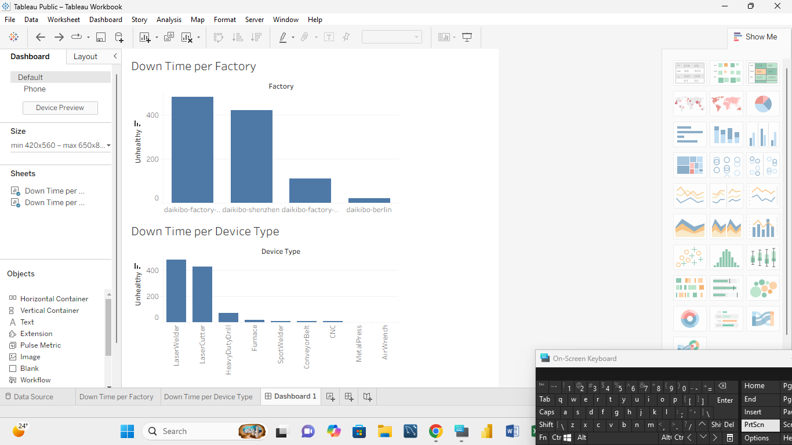

This project demonstrates data visualization in Tableau and logical data transformation in Excel.

## 📊 Tableau: Downtime Analysis
**Objective:** Calculate and visualize potential downtime from equipment telemetry logs.

### Key Technical Steps:
* **Custom Measure:** Created an `Unhealthy` field to represent 10-minute intervals of downtime.
* **Logic:** `IF [Status] = "Unhealthy" THEN 10 ELSE 0 END`
* **Interactive Dashboard:** Built a "Factory-to-Device" filter. Selecting a factory instantly updates the device-specific downtime.

## 📈 Excel: Equality Classification
**Objective:** Automate the categorization of employee equality scores.

| Factory | Job Role | Equality Score | Equality Class |
| :--- | :--- | :--- | :--- |
| Daikibo-F1 | Technician | 10 | Fair |
| Daikibo-F2 | Manager | -11 | Unfair |
| Daikibo-F3 | Engineer | -30 | Highly Discriminative |

*Logic Applied:* - **Fair:** +/- 10
- **Unfair:** > 10 or < -10
- **Highly Discriminative:** > 20 or < -20

